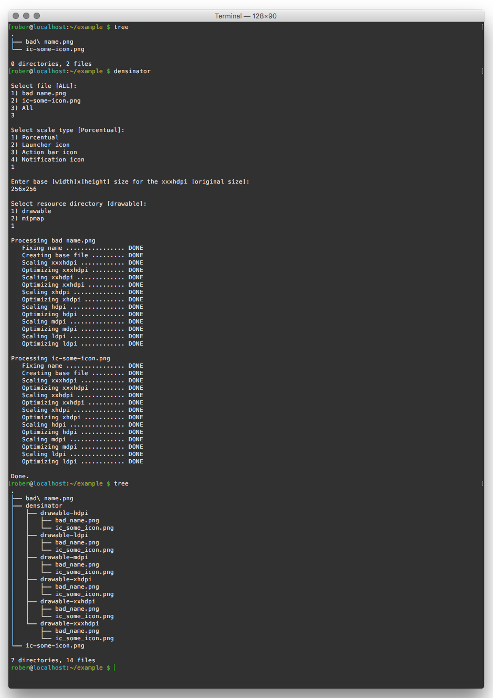

# Densinator

Densinator is a Bash script, that scans your current directory looking for image files, and generates the drawables for all Android densities.


Densinator requires the following libraries to be installed and available on `$PATH`

- [ImageMagick](http://www.imagemagick.org/script/binary-releases.php) for image size manipulation

>`$ brew install imagemagick --with-librsvg`

- [pngquant](https://pngquant.org/) for PNG size optimization

>`$ brew install pngquant`

[](https://android-arsenal.com/details/1/2535)

## Get the script

```
$ git clone https://github.com/robertoestivill/densinator
$ cd densinator
```

or download from [here.](https://raw.githubusercontent.com/robertoestivill/densinator/master/densinator)


Make sure the script is executable

```bash
$ chmod +x densinator
```

## Inputs


**Select file**

```
Select file [ALL]:
1) image1.png
2) image2.png
3) All
```


**Scale type**

```
Select scale type [Porcentual]:
1) Porcentual
2) Launcher icon
3) Action bar icon
4) Notification icon
```


**Enter base size**

```
Enter base [width]x[height] size for the xxxhdpi [original size]:


```


**Resource directory**

```
Select resource directory [drawable]:
1) drawable
2) mipmap
```

## Formats

Densinator will scan the current directory for `png`, `jpg`, `jpeg` and `svg` files.

The output files will always be `png`

Support for `svg` files is currently very primitive.


## Example



## License

```
The MIT License (MIT)

Copyright (c) 2015 Roberto Estivill

Permission is hereby granted, free of charge, to any person obtaining a copy
of this software and associated documentation files (the "Software"), to deal
in the Software without restriction, including without limitation the rights
to use, copy, modify, merge, publish, distribute, sublicense, and/or sell
copies of the Software, and to permit persons to whom the Software is
furnished to do so, subject to the following conditions:

The above copyright notice and this permission notice shall be included in all
copies or substantial portions of the Software.

THE SOFTWARE IS PROVIDED "AS IS", WITHOUT WARRANTY OF ANY KIND, EXPRESS OR
IMPLIED, INCLUDING BUT NOT LIMITED TO THE WARRANTIES OF MERCHANTABILITY,
FITNESS FOR A PARTICULAR PURPOSE AND NONINFRINGEMENT. IN NO EVENT SHALL THE
AUTHORS OR COPYRIGHT HOLDERS BE LIABLE FOR ANY CLAIM, DAMAGES OR OTHER
LIABILITY, WHETHER IN AN ACTION OF CONTRACT, TORT OR OTHERWISE, ARISING FROM,
OUT OF OR IN CONNECTION WITH THE SOFTWARE OR THE USE OR OTHER DEALINGS IN THE
SOFTWARE.
```
